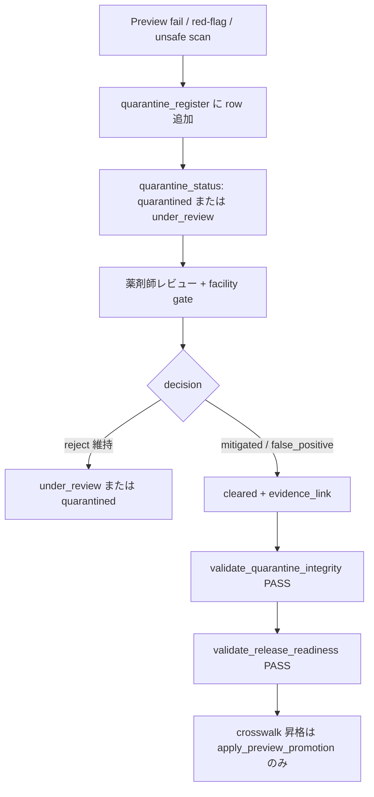

# Unapproved Content Quarantine（Runbook Commit 13）

## 文書の位置づけ

未承認または red-flag 該当の derived knowledge 内容を **user-facing export から隔離** するための operator-side 規程です。Custom GPT Knowledge upload 対象ではありません。

quarantine は **failure の隠蔽** ではなく、昇格前に blocker を可視化するための register です。

## 正本 register

[knowledge_quarantine_register.csv](../manifest/knowledge_quarantine_register.csv)

機械検証: [validate_quarantine_integrity.py](../tests/validate_quarantine_integrity.py)

## quarantine 対象（典型）

| finding_type | 説明 | 典型 source_validator |
| --- | --- | --- |
| `pending_pharmacist_red_flag_review` | 薬剤師 red-flag domain の boundary export | `pharmacist_red_flag_review_checklist.md` |
| `pending_preview_evidence` | Preview 未実行 / pending record | `preview_test_protocol.md` |
| `pending_facility_confirmation` | 施設採用品・手順未確認 | `validate_facility_confirmation_status.py` |
| `unsafe_pattern_hold` | `validate_unsafe_patterns.py` の RED/YELLOW（joinable id） | `validate_unsafe_patterns.py` |

## ステータス定義

| quarantine_status | 意味 |
| --- | --- |
| `quarantined` | 昇格禁止。blocking_reason 必須。 |
| `under_review` | レビュー中。昇格禁止。 |
| `cleared` | 解除済み。`review_disposition` + evidence + cleared_by/date 必須。 |

| review_disposition | 意味 |
| --- | --- |
| `pending` | 薬剤師 / operator 判断待ち |
| `confirmed_red_flag` | red-flag 確定。修正または boundary 言い換え後に再レビュー |
| `false_positive` | スキャン誤検知。evidence 必須 |
| `mitigated` | 文面修正・provenance 更新で緩和。evidence 必須 |

## ワークフロー

## Commit 13 登録方針（2026-06-02）

1. drug-data / CDS / facility 高リスク chunk に **governance hold** を登録（医療断定の新規追加なし）。
2. すべて `quarantine_status=under_review`、`review_disposition=pending`。
3. `cleared` 行は **0 件**（薬剤師 sign-off 未実施のため）。
4. active quarantine がある限り、いかなる chunk も `release_readiness=external_ready_candidate` にしない。

## 禁止事項

1. quarantine なしで unapproved 数値・混注可否・CDS ロジックを knowledge に追加する。
2. reference PMDA 123+3+1 を TARGET の「全件解決済み」として naturalize する。
3. Preview pending を理由に `facility_confirmation_status=confirmed` にする。
4. `cleared` を evidence なしで記録する。

## sibling reference との境界

`references/neurosurgery_safe_rag_pmda_product_source_register_resolved/05_QUARANTINE/` の危険 claim は **REFERENCE 作業用** である。本 register は **derived knowledge 13 本** の chunk 昇格 gate のみを管理する。REFERENCE 行を無批判に `cleared` しない。
